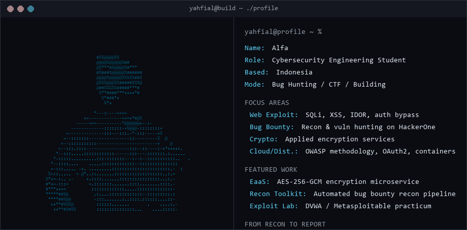

  

## About Me

I am **Yahfi**, i'm focused on the intersection of **offensive security, web application security, and applied cryptography**.

My current focus is hands-on: hunting real vulnerabilities through bug bounty programs, sharpening exploitation skills through CTF, and building security-first tooling — while keeping a strong academic foundation in distributed systems and cloud security.

## Current Focus

| Area | What I am exploring |
|---|---|
| **Web Exploitation** | SQLi, XSS, IDOR, auth bypass, business logic flaws — via CTF and real-world bug bounty targets |
| **Bug Bounty** | Active recon & vulnerability hunting on HackerOne programs |
| **Applied Cryptography** | Building encryption services and understanding crypto implementation pitfalls |
| **Cloud & Distributed Security** | OWASP risk methodology, OAuth 2.0 flows, container security, cloud infra hardening |

## Featured Work

| Project | Focus | Why it matters |
|---|---|---|
| **Encryption as a Service** | Applied cryptography / microservice security | Containerized Flask microservice implementing AES-256-GCM encryption with MongoDB backend |
| **HackerOne Recon Toolkit** | Bug bounty automation | Personal recon pipeline (subfinder, amass, gau, waybackurls, httpx) with structured reporting workflow |
| **DVWA/Metasploitable Exploitation Lab** | Offensive security practicum | Hands-on exploitation of SQLi, XSS, IDOR, broken auth, and legacy service vulnerabilities |
| **OWASP Risk Rating Assessment** | Vulnerability assessment methodology | Structured risk analysis applying OWASP methodology across 5 vulnerability classes |

## Tech Stack

## Recent Activity

<!--RECENT_ACTIVITY:start-->
1. ⬆️ Pushed to [yahfial/yahfial](https://github.com/yahfial/yahfial) 
2. ⬆️ Pushed to [yahfial/yahfial](https://github.com/yahfial/yahfial) 
3. ⬆️ Pushed to [yahfial/yahfial](https://github.com/yahfial/yahfial) 
4. ⬆️ Pushed to [yahfial/yahfial](https://github.com/yahfial/yahfial) 
5. ⬆️ Pushed to [yahfial/yahfial](https://github.com/yahfial/yahfial) 
<!--RECENT_ACTIVITY:end-->
<!--RECENT_ACTIVITY:last_update-->
Last Updated: Wednesday, August 5th, 2026, 3:17:39 AM
<!--RECENT_ACTIVITY:last_update_end-->
